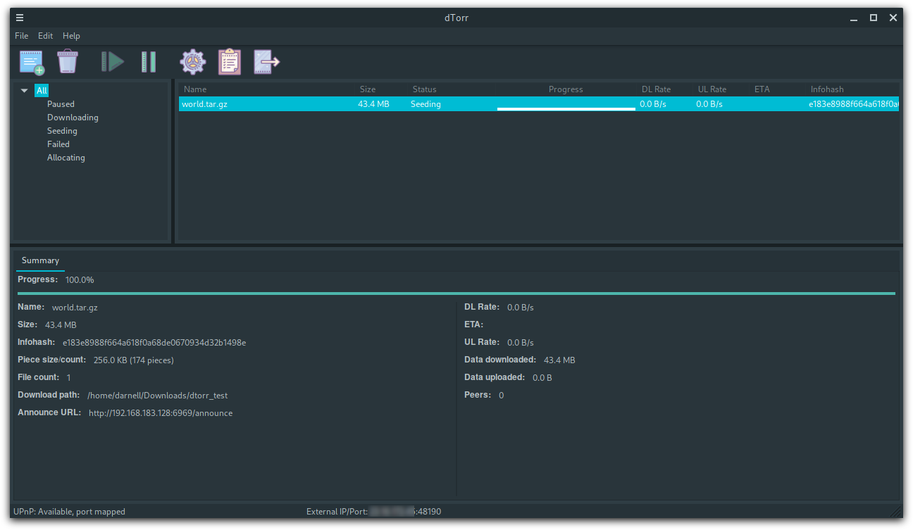
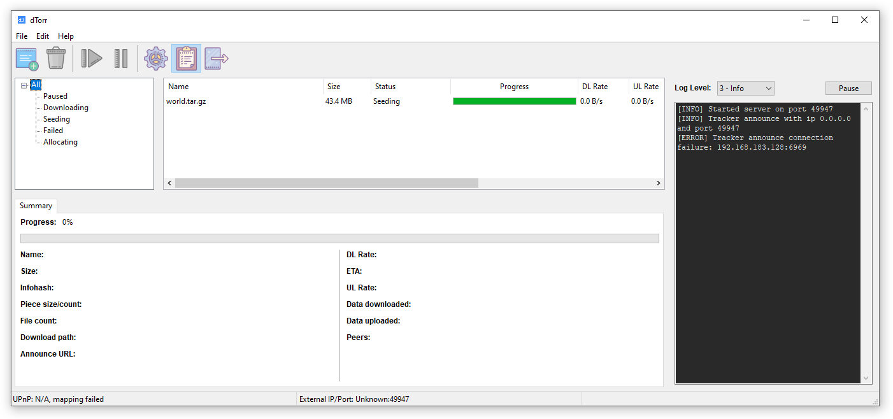

  
  <h1>dtorr</h1>

#### BitTorrent client written in Python and C. Linux/Windows

This repository contains the front-end application, which consumes the BitTorrent library [libdtorr](https://github.com/djandries/libdtorr).

Automatic UPnP port forwarding is supported.

## Screenshots

### Linux (Cinnamon)

### Windows

## Install/Execution

Check-out and build the [libdtorr](https://github.com/djandries/libdtorr) library.

Check-out this repository, in the same parent directory of the library.

Create a Python venv if you wish (`python -m venv env` and `env/bin/activate`).

Install the Python dependencies: `pip install -r requirements.txt`

Run the application: `python main.py`

## Limitations

See [libdtorr](https://github.com/djandries/libdtorr) for limitations
